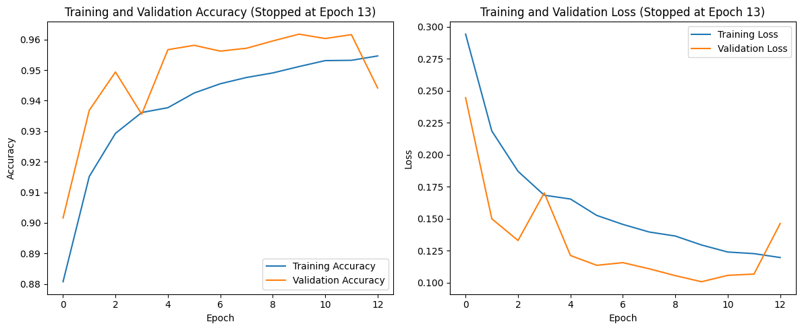
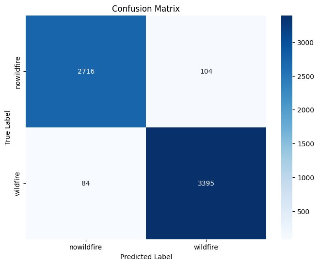
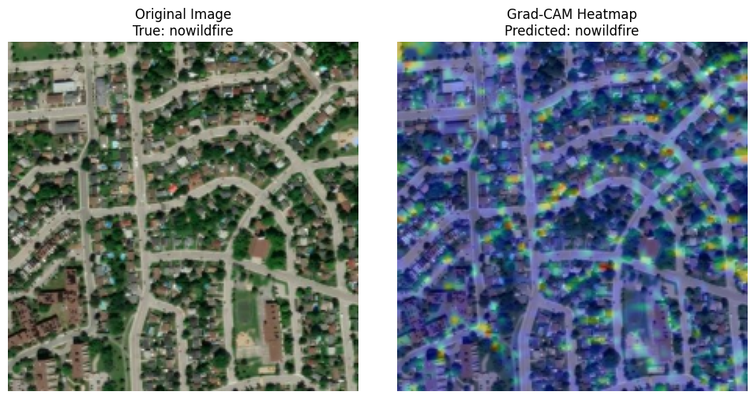

# 🌲 Wildfire Classification using Satellite Images & CNN


## 🚀 Project Overview

This project implements a **Convolutional Neural Network (CNN)** to automatically detect wildfires from satellite imagery. The model achieves **97.02% test accuracy** and provides interpretable predictions using Grad-CAM visualization.

### 🎯 Goal
Early detection of wildfires using satellite images can help firefighting teams respond faster and save lives, property, and natural habitats.

---

## 📊 Dataset

| Property | Value |
|----------|-------|
| **Source** | [Wildfire Prediction Dataset](https://www.kaggle.com/datasets/abdelghaniaaba/wildfire-prediction-dataset) (Kaggle) |
| **Total Images** | 42,848 |
| **Image Size** | 224×224 pixels (RGB) |
| **Classes** | 2: `wildfire`, `nowildfire` |

### Data Split

| Set | Images |
|----|--------|
| Training | 30,249 |
| Validation | 6,300 |
| Test | 6,299 |

---

## 🏠 Model Architecture

```
Input (224×224×3)
    ↓
Data Augmentation (RandomFlip, RandomRotation, RandomZoom, RandomContrast)
    ↓
Rescaling (1/255)
    ↓
Conv2D (64 filters, 3×3) → MaxPool2D
    ↓
Conv2D (128 filters, 3×3) → MaxPool2D
    ↓
Conv2D (256 filters, 3×3) → MaxPool2D
    ↓
GlobalAveragePooling2D
    ↓
Dense (384 units, ReLU) → Dropout (0.4)
    ↓
Dense (2 units, Softmax) → Output
```

### Key Components
- **Convolutional Layers**: Feature extraction from images
- **MaxPooling2D**: Dimensionality reduction
- **Dropout (0.4)**: Prevention of overfitting
- **Data Augmentation**: Image rotation, flip, zoom, contrast adjustments

### Optimized Hyperparameters
| Parameter | Value |
|-----------|-------|
| Filters | 64 |
| Dense Units | 384 |
| Dropout | 0.4 |
| Learning Rate | 0.001 |
| Batch Size | 32 |

---

## 📈 Results

| Metric | Score |
|--------|-------|
| **Test Accuracy** | 97.02% |
| **Precision** | 0.97 |
| **Recall** | 0.97 |
| **F1-Score** | 0.97 |

### 📊 Output Visualizations

#### Training Progress: Accuracy & Loss


#### Confusion Matrix


#### Sample Predictions


---

## 🛠️ Technologies Used

- **TensorFlow 2.18** - Deep learning framework
- **Keras Tuner** - Hyperparameter optimization
- **Scikit-learn** - Model evaluation metrics
- **Matplotlib & Seaborn** - Data visualization
- **NumPy** - Numerical operations

---

## 📓 Kaggle Notebook

The complete project is also available on Kaggle:

🔗 [Wildfire Classification CNN](https://www.kaggle.com/code/humankey/wildfire-classification-using-satellite-images-cnn)

---

## 🚦 Getting Started

### Prerequisites
- Python 3.11+
- TensorFlow 2.18+
- 8GB+ RAM recommended

### Installation

```bash
# Clone the repository
git clone https://github.com/se-ka1500/wildfire-classification-cnn.git
cd wildfire-classification-cnn

# Run on Jupyter (local) or upload to Kaggle/Colab
jupyter notebook
```

> **Note:** The dataset is not included in this repository due to size. Access it directly from [Kaggle](https://www.kaggle.com/datasets/abdelghaniaaba/wildfire-prediction-dataset).

---

## 📁 Project Structure

```
wildfire-classification-cnn/
├── README.md                                          # This file
├── images/                                           # Output visualizations
│   ├── output_000.png                               # Dataset split distribution
│   ├── output_001.png                               # Class distribution
│   ├── output_002.png                               # Sample images
│   ├── output_003.png                               # Training accuracy/loss curves
│   ├── output_004.png                               # Final training results
│   ├── output_005.png                               # Confusion matrix
│   └── output_006.png                               # Grad-CAM visualization
└── wildfire-classification-using-satellite-images-cnn.ipynb  # Complete notebook
```

---

## 📜 License

MIT License - Feel free to use this project for learning or development purposes.

---

## 👤 Author

**Semih Kaya**  
- GitHub: [@se-ka1500](https://github.com/se-ka1500)  
- Kaggle: [@humankey](https://www.kaggle.com/code/humankey)

---

## 🙏 Acknowledgments

- [Wildfire Prediction Dataset](https://www.kaggle.com/datasets/abdelghaniaaba/wildfire-prediction-dataset) - Dataset provider
- [Akbank Deep Learning Bootcamp](https://www.kaggle.com) - Project inspiration and guidance